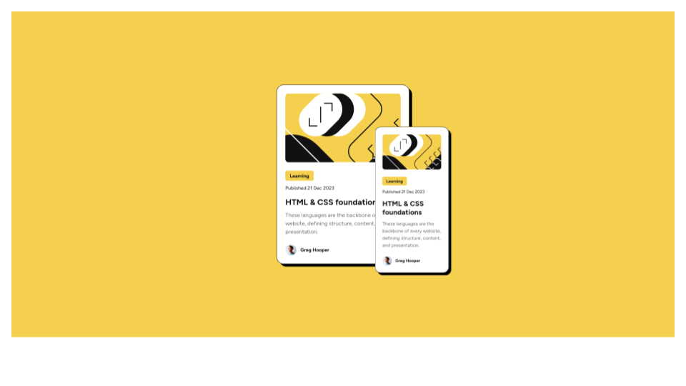

# Frontend Mentor - Blog preview card solution

This is a solution to the [Blog preview card challenge on Frontend Mentor](https://www.frontendmentor.io/challenges/blog-preview-card-ckPaj01IcS).

## Overview

### The challenge

Users should be able to:

- See hover and focus states for all interactive elements on the page

### Screenshot

## Build with

- Semantic HTML5 markup
- CSS custom properties
- Flexbox

### Useful links

- [Learn CSS Flexbox in 20 minutes (course)](https://www.youtube.com/watch?v=wsTv9y931o8&t=1101s)
